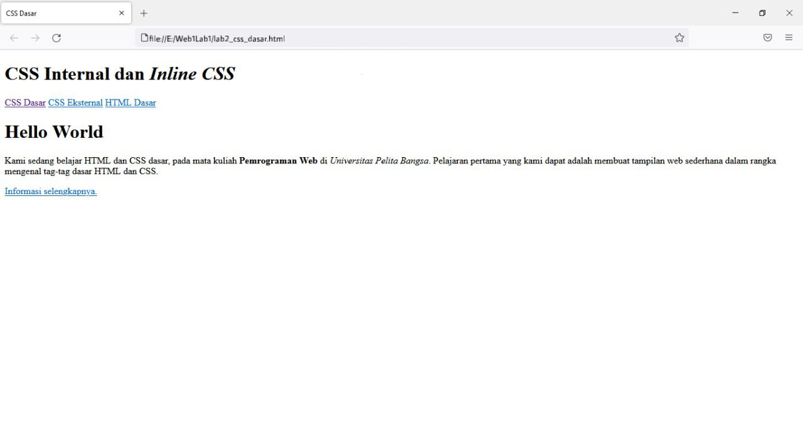
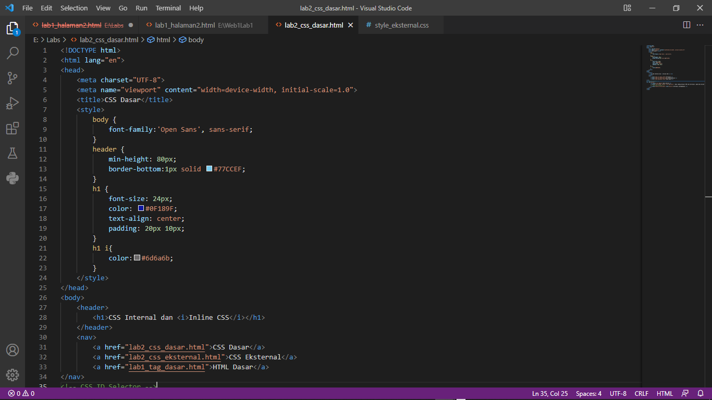
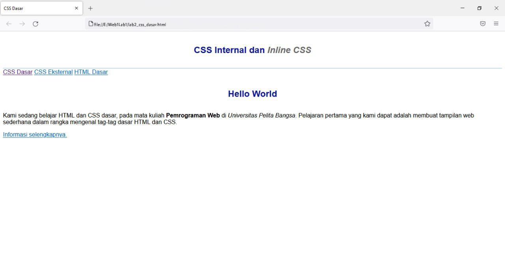
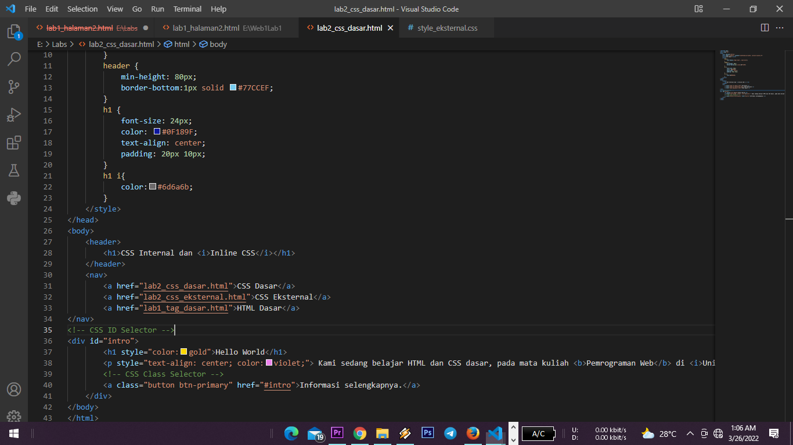
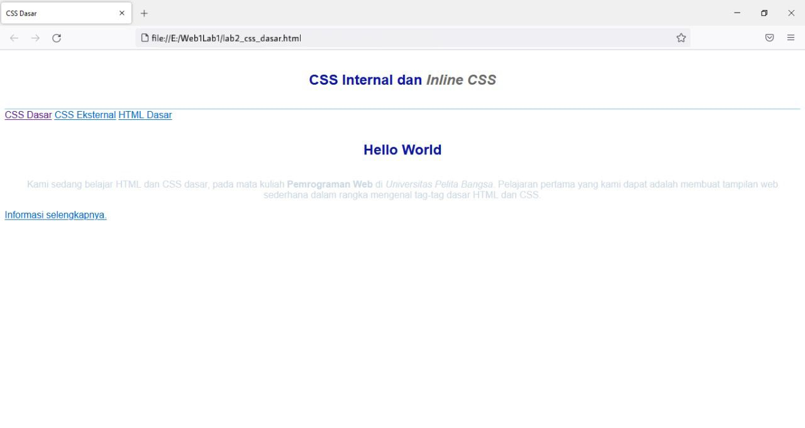
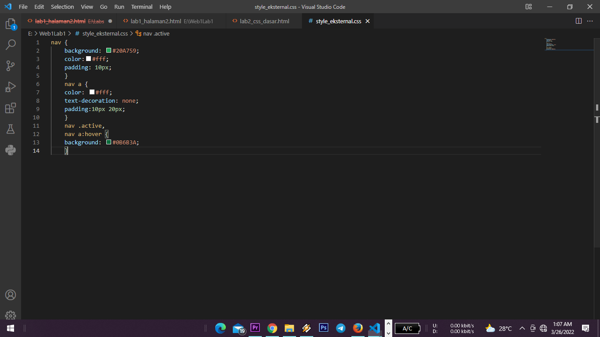
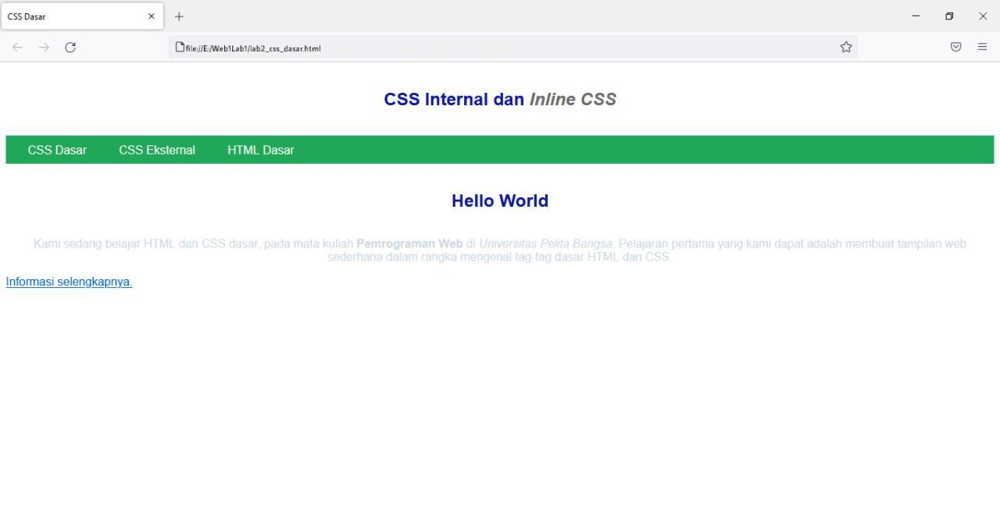
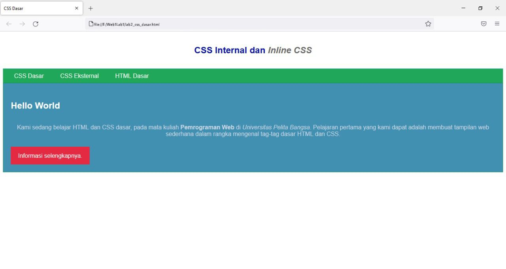
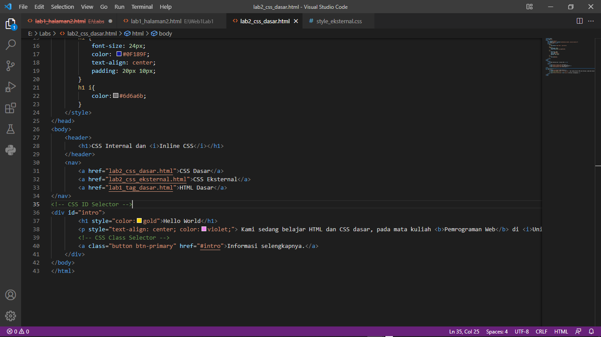
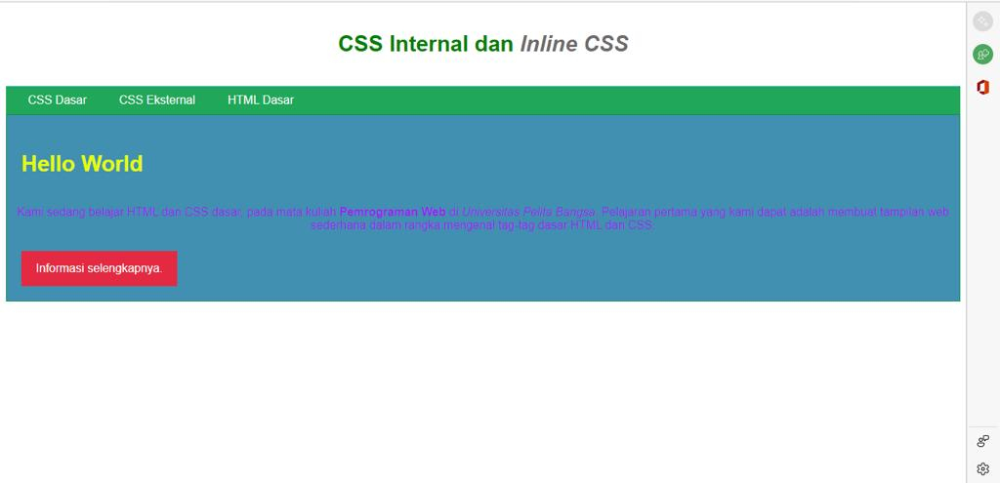

# Lab2Web
## Belajar CSS dasar HTML

1. Lakukan eksperimen dengan mengubah dan menambah properti dan nilai pada kode CSS dengan mengacu pada CSS Cheat Sheet yang diberikan pada file terpisah dari modul ini.

2. Apa perbedaan pendeklarasian CSS elemen h1 {...} dengan #intro h1 {...}? berikan penjelasannya!
   Jawab : elemen h1{...} untuk menampilkan heading 1 , intro h1 {...} untuk memberi style pada output tertentu . 

3.  Apabila ada deklarasi CSS secara internal, lalu ditambahkan CSS eksternal dan inline CSS pada elemen yang sama. Deklarasi manakah yang akan ditampilkan pada browser? Berikan penjelasan dan contohnya! jawab :deklarasi utama yang akan muncul yaitu inline , internal dan eksternal .

4. Pada sebuah elemen HTML terdapat ID dan Class, apabila masing-masing selector tersebut terdapat deklarasi CSS, maka deklarasi manakah yang akan ditampilkan pada browser? Berikan penjelasan dan contohnya! ( 
 )
karena spesifik nya selector id dari class 2 elemen p , kecuali kita menambahkan proprti pada inline elemen p maka smntara elemen ini akn trtimpa.
